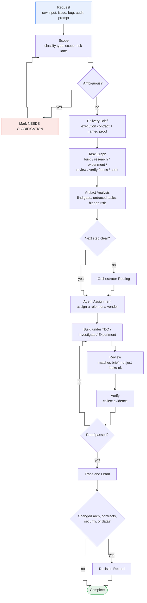
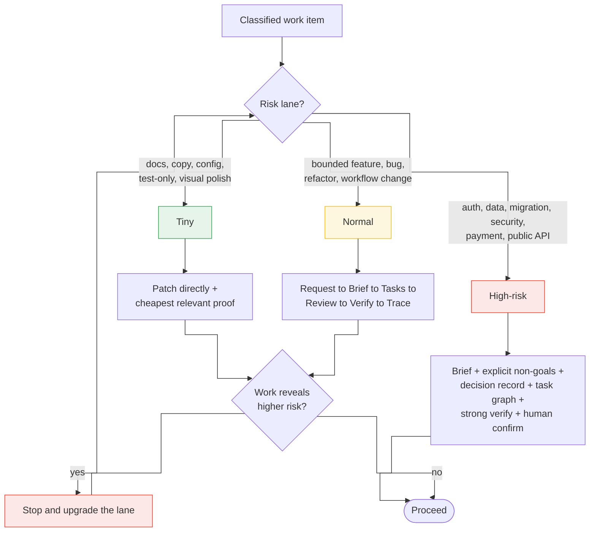

# Lifecycle

The standard lifecycle is:

```text
Request
  -> Scope
  -> Delivery brief
  -> Task graph
  -> Artifact analysis
  -> Orchestrator routing when needed
  -> Agent assignment
  -> Build under TDD, investigate, or experiment
  -> Review
  -> Verify
  -> Trace and learn
```

As a diagram, including the loops back when proof or clarity is missing:



Risk lane decides how much of this lifecycle a change actually needs
(`harness/rules/risk-lanes.md`):



## 1. Request

A request is the raw input: issue, product request, bug report, audit request,
QA request, or human prompt.

Use `docs/delivery/templates/request.md`.

## 2. Scope

Scope turns the raw request into a classified work item.

Scope answers:

- What type of work is this?
- Who is affected?
- What outcome is expected?
- What current behavior exists?
- What target behavior is desired?
- What is out of scope?
- What risk lane applies?
- What is still ambiguous?

Use `NEEDS CLARIFICATION: specific question` for ambiguity that should not be
guessed.

## 3. Delivery Brief

A delivery brief is the execution contract. It should be short, concrete, and
reviewable.

Use `docs/delivery/templates/delivery-brief.md`.

Do not write a delivery brief for tiny work unless the tiny change is unclear.

## 4. Task Graph

Split the brief into task files. Tasks may depend on each other.

Use `docs/delivery/templates/task.md`.

Task types:

- `build`: implementation work.
- `research`: codebase or product investigation.
- `experiment`: bounded proof of concept for a specific proposed solution.
- `review`: independent review of a change.
- `verify`: proof collection.
- `docs`: documentation or decision updates.
- `audit`: security, quality, or architecture audit.

Mark independent tasks with `parallelizable: true` when they can be executed
without sharing files, state, or ordering assumptions.

## 5. Artifact Analysis

Before implementation, review the request, brief, and task files for:

- Unresolved clarification markers.
- Acceptance criteria without proof.
- Production implementation tasks without TDD pairs or a recorded exception.
- Tasks that do not trace to the brief.
- Brief requirements with no task or explicit non-goal.
- High-risk work hidden inside normal or tiny tasks.
- Contradictions between scope, non-goals, and task instructions.
- Parallel tasks that share files, surfaces, or state.
- Experiment tasks without hypothesis, success criteria, storage location,
  proof, or production-boundary rule.

## 6. Orchestrator Routing

Use the Orchestrator Agent when the next role, risk lane, proof, owner,
parallelization plan, or human escalation path is unclear.

If the next step is already clear, continue directly to agent assignment.

## 7. Agent Assignment

Assign each task to a role, not a vendor-specific agent:

- Scope Agent
- Orchestrator Agent
- Planner Agent
- Builder Agent
- Reviewer Agent
- Verifier Agent
- Security Agent
- QA Agent
- Recorder Agent

The actual runtime can be Codex, Claude, Cursor, Copilot, a human, or a CI job.

## 8. Build, Investigate, Or Experiment

The assigned agent works inside the task boundary.

The agent should:

- Read the brief and task.
- Follow `harness/rules/tdd-rules.md` for production implementation.
- Read only the relevant code and docs.
- Avoid unrelated refactors.
- Preserve user changes.
- Update the task with blockers or important decisions.

For `experiment` tasks, use `docs/delivery/templates/experiment.md` and default experiment
work to `experiments/` unless the user, delivery brief, or task names another
location. Experiment code is not production code, and production code must not
import from `experiments/`.

An experiment must record:

- The hypothesis being tested.
- Success criteria.
- Proof collected.
- Result: `proven`, `disproven`, `inconclusive`, or `blocked`.
- Whether to discard the experiment, revise the approach, run another
  experiment, or promote the learning into production implementation.

## 9. Review

Review checks whether the work matches the brief, not whether it merely looks
reasonable.

Use `docs/delivery/templates/review.md`.

Review should prioritize:

- Behavioral bugs.
- Security and data risks.
- Contract mismatches.
- Missing proof.
- Unwanted scope expansion.

## 10. Verify

Verification collects evidence that the change works.

Use `docs/delivery/templates/verification.md`.

Verification can include:

- Unit tests.
- Integration tests.
- End-to-end tests.
- Build checks.
- Manual QA.
- Screenshots.
- API responses.
- Security scan output.
- Performance numbers.

## 11. Trace And Learn

Trace records what happened and what future agents should know.

Use `docs/delivery/templates/trace.md`.

If the work changed architecture, product behavior, security posture, public
contracts, data ownership, or validation standards, also write a decision record
using `docs/delivery/templates/decision.md`.
